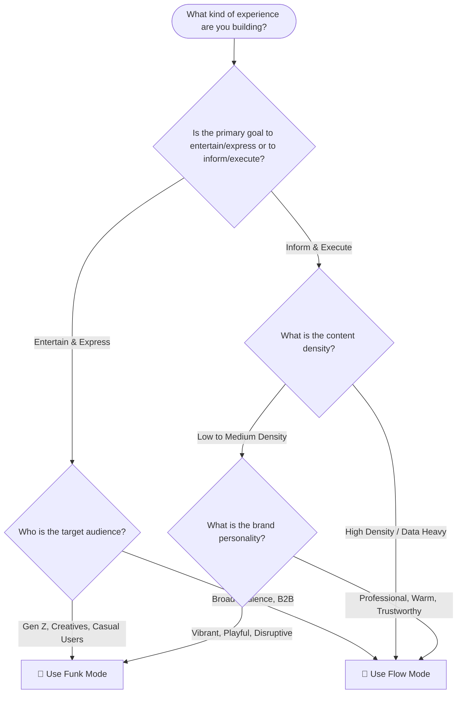

# Funk vs Flow: Mode Decision & Reference Guide

Funky Design offers two distinct visual and kinetic modes: **Funk 🎸** and **Flow 🌊**. While both share the same underlying architecture, tokens, and typography (Satoshi, system-ui, JetBrains Mono), they express radically different personalities.

This document is the definitive guide to choosing, comparing, and implementing modes.

---

## 1. Decision Guide

Choosing a mode is a foundational decision for your product or view. Use this flowchart-style guide to determine which mode fits your use case.



### Recommendation Summary
- **Choose Funk 🎸 if:** You are building a marketing site, a consumer social app, a creative tool, or a gamified experience. You want to maximize expression and don't mind elements taking up slightly more space.
- **Choose Flow 🌊 if:** You are building B2B software, a dense dashboard, an administrative panel, or a tool where users spend hours doing focused work. You need professional warmth and predictable, consistent layouts.

---

## 2. Full System Comparison

| System Parameter | Funk 🎸 | Flow 🌊 |
| :--- | :--- | :--- |
| **Spring Damping** | `0.4` (Bouncy, resonant) | `0.8` (Smooth, settled) |
| **Spring Stiffness** | `300` | `250` |
| **Corner Radius Strategy** | Asymmetric, organic combinations | Consistent, predictable scales |
| **Shadow Style** | Colored, highly saturated | Neutral, subtle, depth-focused |
| **Color Saturation / Chroma** | Maximum OKLCH chroma (`~0.25+`) | Moderated OKLCH chroma (`~0.15`) |
| **Max Accents per Viewport** | 3-4 (Vibrant combinations) | 1-2 (Focused highlights) |
| **Shape Morphing** | Yes (e.g., squircle to pill on hover) | No (static shapes only) |
| **Typography Display Weight** | Black (`900`) | Bold (`700`) |
| **Typography Tracking** | Tighter (`-0.03em` on display) | Normal (`-0.01em` on display) |
| **Hover Effects** | Scale up (`1.05`), rotate (`2deg`), pop | Subtle lift (`translateY(-2px)`) |
| **Press Feedback** | Deep squish (Scale `0.9`) | Gentle indent (Scale `0.97`) |
| **Asymmetric Corners** | Yes (e.g., `24px 8px 24px 8px`) | No (e.g., `12px` all around) |
| **Gradient Usage** | Allowed for accents and text highlights | Banned (solid colors only) |
| **Loading Indicators** | Bouncy, shape-shifting blobs | Smooth, continuous spinners/bars |
| **Card Hover Behavior** | Lift + colored shadow burst | Lift + subtle neutral shadow |
| **Tab Indicator Style** | Pill that morphs and bounces | Underline or simple highlight block |
| **Toggle Animation** | Overshoot bounce | Smooth slide |
| **Toast Entry** | Spring up with rotation overshoot | Slide in and fade up smoothly |
| **Focus Ring Style** | Double ring, highly contrasting offset | Single ring, subtle alpha offset |
| **Button Border Treatment** | Thicker (`2px`), contrast borders | Thin (`1px`), subtle or borderless |

---

## 3. Visual Examples (Side-by-Side)

### Button Component
```css
/* Funk 🎸 Button */
.btn-funk {
  border-radius: 24px 8px 24px 8px; /* Asymmetric */
  box-shadow: 4px 4px 0 var(--color-accent-violet); /* Hard colored shadow */
  transition: transform 0.4s cubic-bezier(0.175, 0.885, 0.32, 1.275); /* Bouncy */
}
.btn-funk:hover {
  transform: scale(1.05) rotate(-2deg);
  border-radius: 9999px; /* Shape morphing to pill */
}
.btn-funk:active {
  transform: scale(0.9);
}

/* Flow 🌊 Button */
.btn-flow {
  border-radius: 8px; /* Consistent */
  box-shadow: 0 1px 2px var(--shadow-neutral-sm); /* Subtle neutral depth */
  transition: transform 0.2s cubic-bezier(0.4, 0, 0.2, 1); /* Smooth */
}
.btn-flow:hover {
  transform: translateY(-1px);
  box-shadow: 0 4px 6px var(--shadow-neutral-md);
}
.btn-flow:active {
  transform: scale(0.97);
}
```

### Card Component
```css
/* Funk 🎸 Card */
.card-funk {
  border-radius: 32px 12px 32px 12px;
  border: 2px solid var(--color-surface-sunlit-contrast);
  box-shadow: 8px 8px 0 var(--color-accent-coral);
}
.card-funk:hover {
  box-shadow: 12px 12px 0 var(--color-accent-fuchsia); /* Burst of color */
}

/* Flow 🌊 Card */
.card-flow {
  border-radius: 12px;
  border: 1px solid var(--color-surface-overcast-border);
  box-shadow: 0 4px 12px var(--shadow-neutral-md);
}
.card-flow:hover {
  box-shadow: 0 8px 24px var(--shadow-neutral-lg); /* Increased depth */
}
```

---

## 4. Mixing Modes

While you should generally stick to one mode per view, there are strategic times to mix them.

### When to mix:
1. **Marketing vs. Product:** Marketing site (home, features, pricing) uses Funk 🎸 to stand out and express the brand. The core web app/dashboard uses Flow 🌊 for focused productivity.
2. **Onboarding:** A playful onboarding wizard in Funk 🎸 that settles into a Flow 🌊 dashboard once complete.
3. **Empty States / Celebrations:** A predominantly Flow 🌊 application might use Funk 🎸 mechanics for empty states (playful illustrations) or success celebrations (completion modals).

### Handling the Transition Zone
Avoid placing Funk and Flow elements adjacent to each other in the same layout hierarchy. If you must mix them on the same page, create clear visual breaks (e.g., a full-width background color change) between the sections. 

### CSS Scoping Strategy
Rely on data-attributes applied to the `<body>` or major layout wrappers. Do not interleave classes manually unless absolutely necessary.

```html
<!-- Example of separation -->
<main data-funky-mode="funk">
  <section class="hero-marketing">...</section>
</main>
<main data-funky-mode="flow">
  <section class="user-dashboard">...</section>
</main>
```

---

## 5. Mode Tokens

This is the definitive token mapping for switching between modes at the root or container level.

```css
/* Base/Fallback (Defaults to Flow) */
:root {
  /* Default motion (Flow) */
  --spring-stiffness: 250;
  --spring-damping: 0.8;
  --transition-default: transform 0.2s cubic-bezier(0.4, 0, 0.2, 1);
  
  /* Default corners (Flow) */
  --radius-sm: 4px;
  --radius-md: 8px;
  --radius-lg: 12px;
  --radius-xl: 16px;
  --radius-pill: 9999px;
  --radius-action: var(--radius-md);
  --radius-container: var(--radius-lg);
  
  /* Default typography (Flow) */
  --font-weight-display: 700;
  --tracking-display: -0.01em;
  
  /* Default interactions (Flow) */
  --scale-hover: 1;
  --scale-press: 0.97;
  --shadow-hover-color: var(--color-surface-midnight-alpha-10);
}

/* Flow 🌊 Mode (Explicit) */
[data-funky-mode="flow"] {
  /* Enforces base variables above */
  --radius-action: var(--radius-md);
  --radius-container: var(--radius-lg);
  --scale-hover: 1;
  --scale-press: 0.97;
}

/* Funk 🎸 Mode */
[data-funky-mode="funk"] {
  /* Bouncy motion */
  --spring-stiffness: 300;
  --spring-damping: 0.4;
  --transition-default: transform 0.4s cubic-bezier(0.175, 0.885, 0.32, 1.275);
  
  /* Asymmetric corners */
  --radius-action: 24px 8px 24px 8px;
  --radius-container: 32px 12px 32px 12px;
  
  /* Bold, tight typography */
  --font-weight-display: 900;
  --tracking-display: -0.03em;
  
  /* Energetic interactions */
  --scale-hover: 1.05;
  --scale-press: 0.9;
  --shadow-hover-color: var(--color-accent-coral); /* High chroma OKLCH accent */
}
```
